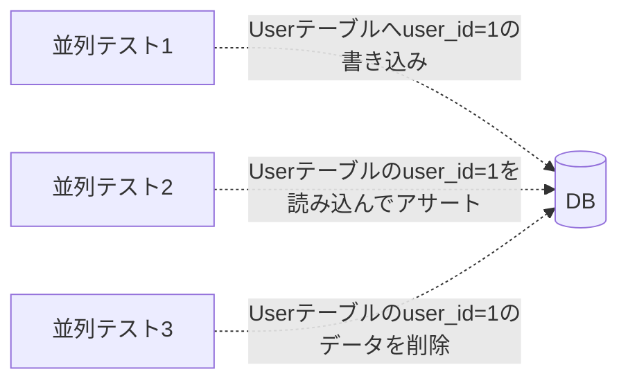
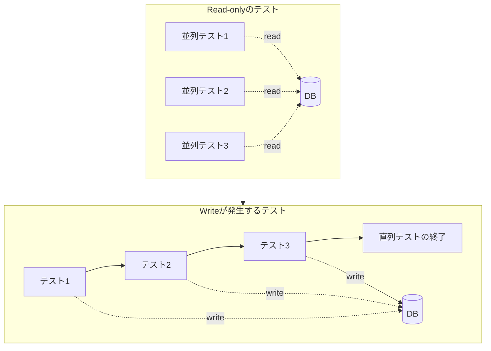
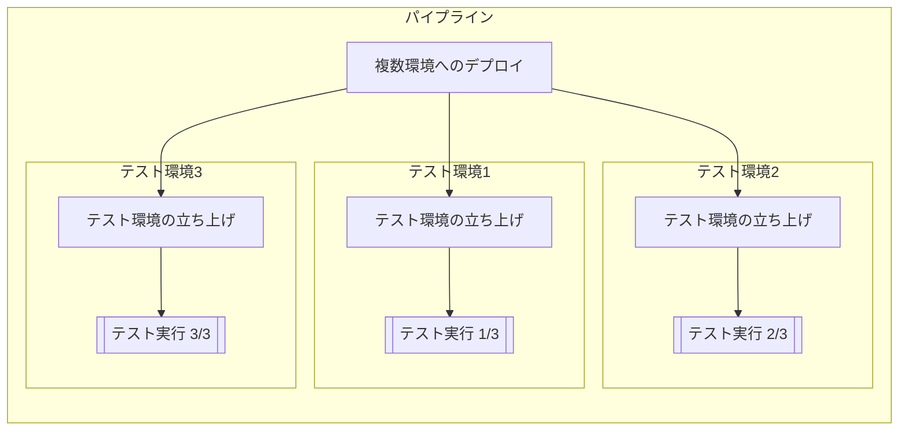
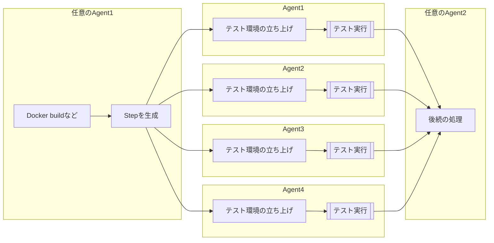
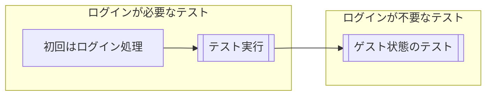
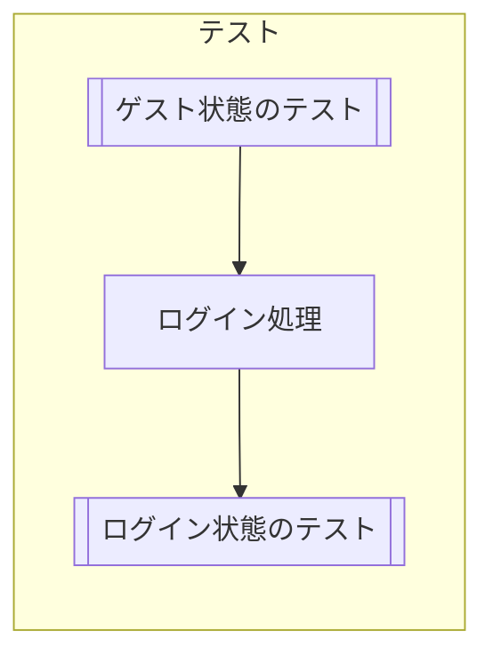

# イントロダクション

私の所属する組織ProductTeamではTDDを実践しており、すべての開発においてWeb-E2E、Module-E2E、UnitTestなどを書き実装を進めています。必ずCIを通してデプロイするという環境のため、CIの高速化と安定化は非常に重要な課題です。

また、組織にはチームシャッフル[^1]という文化があり、数ヶ月～1年程度でチームの構成が変わります。そのため私はこれまでに複数のチームでCIを改善する機会がありました。
それらのプロジェクトでは、数年もののE2Eプロジェクトだったり、まだ小規模なもの、それぞれ課題や環境が異なっていました。

今回はその中で得た知見をまとめ、**CIの高速化と安定化を実現するためのTipsを紹介します。**

:::message
ProductTeamでは [Selenide](https://selenide.org/) や [Gauge](https://gauge.org/index.html) を用いたE2Eテストの実行環境を構築していることがほとんどです。E2EテストのTipsはそれらを前提にしていることが多いことをご了承ください。
<!-- textlint-disable -->
:::
<!-- textlint-enable -->

[^1]: チームの構成を定期的に変更することで、チーム間の知識共有を促進し、エンジニアの挑戦の機会を生み出す仕組みです。

## CIの高速化と安定化の重要性

CIにかかる時間が長いと、開発の効率が落ちたり、顧客へのデリバリーが遅れたりします。
開発生産性の指標であるFourKeysの1つにも "コードの変更から本番環境で稼働するまでの時間「**リードタイム**」" があり、CIにかかる時間はこの指標にも大きく影響します。
CIの不安定さがこのリードタイムに影響することは、想像に難くありません。

もちろん指標を追い求めているだけではありませんが、ユーザーに価値をデリバリーし続けていくためには、CIの高速化と安定化は重要です。

つらつらと書いてきましたが、要は**CIは早ければ早いほど良いし、安定していれば安定しているほど良いということです。**

# テストの安定化

先にも述べたように、テストの不安定さがあってはCIの速度を上げることはできません。
既存のCIの改善に着手する場合、テストの安定化を優先して改善することをおすすめします。

## テストフレームワークを理解し上手く利用する

ものすごくシンプルで基本的な話ですが、テストフレームワークの理解と利用方法を把握していることは、テストの安定化には必須です。
Selenideなどのテストフレームワークは、テストの安定化に役立つ機能を提供しています。

<!-- textlint-disable -->
:::details Selenideの機能例
<!-- textlint-enable -->
- 自動的な要素の待機： 要素が見つかるまで自動的に待機する
- 非同期通信サポート： リクエストの完了を自動的に待機する
- 集成されたアサーション：要素の状態を検証するためのアサーション（Hrefなど）
:::

Selenideに関しては、別記事にもしていますので、そちらも参考にしてください。
[Selenideを利用するときに心がけること](https://zenn.dev/ragnar1904/articles/selenide-essentials)

CypressやPlaywrightなどのテストフレームワークも同様な機能を備えています。
[CypressのImplicit Assertions](https://docs.cypress.io/guides/core-concepts/retry-ability#Implicit-Assertions)

:::message
Web-E2E以外の文脈でも、テストフレームワークの理解はやはり重要です。
最近では[Testing Library](https://testing-library.com/)などでComponentTestを行うことが多くなってきていますが、AriaやRoleなどの概念の理解や、非同期処理の待機方法などを理解すべきことは多いです。
<!-- textlint-disable -->
:::
<!-- textlint-enable -->

## シンプルなテストコードの維持

私の経験では、テストコードをシンプルに保つことは意外と難しいです。

Selenide + Gaugeという構成では、Testを記述したSpecファイルと、実際の処理を記述したStepがあるのですが、Stepはそれぞれただの関数群です。
そのため、気を抜くとStepにロジックが増えてしまい、テストコードが複雑になってしまいます。

<!-- TODO: ここに例をいろいろとかきたい -->

ここ最近では[playtest](https://github.com/uzabase/playtest)という、一般的なGauge Stepを定義したものをライブラリ化して利用しています。例えば、HTTPリクエスト、BodyやStatusなどのアサート、Mockへのリクエスト検証などです。
Module-E2Eなどであれば、基本的なリクエスト/アサートはplaytestに含まれているため、シンプルなStepの組み合わせだけでE2Eを記述できるようになっています。


<!-- textlint-disable -->
:::details Playtestを利用した例
以下のStepはすべてPlaytestに含まれており、Stepを実装しなくてもテストを実装できるようになっています。
<!-- textlint-enable -->
```markdown
## GETリクエスト
* URL"/"にGETリクエストを送る
* レスポンスステータスコードが"200"である
* レスポンスヘッダーに"x-example-header"が存在し、その値が"example1"である
* レスポンスのJSONの"$.message"が文字列の"Hello Playtest-Gauge-Rest!"である
```
:::

## 順番に依存しないテスト

順番に依存するテストが安定性の面で良くないということは、直感的に理解できるはずです。
単体、直列でテストを実行するときは問題なくても、「ファイル名を変更したら壊れた」「不要なTestを消したら壊れた」ということが起きてしまいます。

<!-- TODO: ここに図 -->

また、後で触れる話に関連するのですが「CI上でテストを並列実行すると失敗する」などの問題も発生します。
テストの独立性は、常に意識しておくべきです。


## 確実なデータセットアップ

ElasticSearchなどのDatabaseを利用したテストを行う場合に多いのですが、データセットアップには注意が必要です。

ElasticSearchの場合、fixtureをindexする際にそのデータがindexに反映される時間がかかります。
そのため、以下の方法で回避する必要があります。

- Index Refresh APIを利用する
    更新のリクエストをしたあと、[Refresh API](https://www.elastic.co/guide/en/elasticsearch/reference/current/indices-refresh.html)を叩くことで即座にindex反映される。
- Indexの更新時にRefreshを行う
    クエリパラメータに`?refresh`を指定し更新リクエストを送ると、index反映を待ってレスポンスが帰ってくるようになる（[参考](https://www.elastic.co/guide/en/elasticsearch/reference/current/docs-refresh.html)）。
- Index Refresh Intervalを短くする
    `refresh_interval`を短くすることで、indexに反映されるまでの時間を短くできる。Productionでは反映すべきではないため、管理が少し煩雑になる。

このあたりの情報は、知らないとハマることが多いので、ぜひ覚えておくことをおすすめします。


## CDC（Consumer Driven Contract）の利用によるモジュール間の依存性の解消

私たちのプロダクトはマイクロサービスで構成されており、それぞれのサービスは独立して開発されています。
各マイクロサービスの中には、いろんなモジュールから利用されるAPIもあります。あるAPIがいろんな環境で利用されるようになると、そのAPIの変更の影響範囲を把握することが難しくなります。

<!-- TODO: ここに図 -->

そこで、呼び出すモジュール（Consumer）の開発者が、自分のモジュールが利用するAPI（Provider）の仕様を「Contract」として定義します。
ConsumerはContractを前提にモック化してテストを実施し、ProviderはContractが守られていることを示すテストを実施します。これにより振る舞いを保持しながら双方が独立して開発を進めることができます。

<!-- TODO: ここに図 -->

このようなテスト手法を**Consumer Driven Contract** (CDC)と呼びます。

CDCはテストの安定化や高速化を目的としたものではありませんが、モックを利用できることで高速化にも効果があります。
依存するモジュールのソースのチェックアウトやビルド、デプロイなどを待つ必要がなくなる上、自分が知らないところで起きた修正によってテストが失敗することもありません。
マイクロサービスにおける開発では、必ず利用したいテスト手法です。

:::message
ProductTeamでは、WiremockへのStubをもとにContractを生成する[play-cdc](https://github.com/uzabase/play-cdc)を利用して、効率的にCDCを行っています。
:::


# テストの高速化

ここからは具体的にテストの高速化について紹介していきます。
私の経験上、テストの高速化には以下の2つが効果的です。
- テストの並列実行
- オーバーヘッドの削減

## テストの並列実行

テストの並列実行は、テストの高速化において最も効果的な手法です。
私が実際に取り組んだのは、テストの実行のみを並列化するものと、テスト環境自体を並列化するものの2つです。

:::message alert
テストを分割して実行する場合、必ずすべてのテストが流れていることを確認しましょう。
:::

### 単一環境におけるテストの並列実行

テストフレームワークにはテストの並列実行をサポートしているものが多く、UnitTestなどではデフォルトで並列実行されるものもあります。

しかしE2Eの場合、テストの並列実行はテスト環境の状態を考慮しながら行う必要があります。
具体的な例を考えてみましょう。DBへの書き込みが発生するケースでは、同時に流れているテストが影響し、同じテーブルのデータを見ているテストは失敗します。



テスト環境が1つの場合、Read-onlyのテストは並列実行しても問題ないので、Writeが発生するテストと分割することで並列実行できます。



#### Read-onlyのテストとWriteが発生するテストの分割

```shell
# テスト環境の起動
docker-compose up -d
# ReadOnlyとタグが付いたテストを並列実行
mvn gauge:execute -Dtags="ReadOnly" -DinParallel=true
# ReadOnly以外のテストを直列実行
mvn gauge:execute -Dtags="!ReadOnly"
```

:::message
このとき、Read-onlyのTestのデータセットアップはTest全体が流れる前の一度だけになります。シナリオごとに毎回セットアップはできません。
一方でWriteが発生するテストのデータセットアップは、テストごとに行う必要があります。
:::

#### この手法のメリット
- **どのCI環境でも比較的簡単に実装できる**
  テスト環境さえ立ててしまえれば良いので、インフラを選びません。


#### この手法のデメリット
- **あとから導入が難しい**
  この手法の並列実行をあとから導入することはかなり難しいです。Read-onlyのシナリオを特定し、それらが依存しているデータを特定し他のシナリオと依存し合わないようセットアップする必要があります。
  またMockサーバーのリクエスト検証などが絡むと更に難しくなっていきます。
- **テストによっては、高速化の効果は薄い**
  並列実行できるテストが限られてしまうため、並列実行の効果が限定的です。
- **テストコードの複雑性が上がる**
  Read-onlyなものとそうでないものでデータセットアップのサイクルが変わるので、少し煩雑です。

#### 社内での実践例

ProductTeam内では、この手法を利用しているプロジェクトは多く、新規プロジェクトではこの並列実行を見越してデータセットアップの戦略を立てることもあります。
また、最初は直列実行ではあったものの、後からこの手法を導入したプロジェクトもあります。

ただ実情として、並列化したいWeb-E2Eでは安定しないことも多く、結局直列に戻したという話もあります。
チームシャッフルでメンバーの変わることも多いProductTeamでは、テストコードの複雑性のデメリットが大きいかもしれません。

### 複数環境でのテストの並列実行

Test環境自体を複数にし、テストを分割することで並列実行を行うこともできます。
k8sのNamespaceを複数利用して環境を分割するなどが考えられます。



#### この手法のメリット
- **テストの安定性が高い**
  テスト環境はそれぞれ独立しているため、分割したテスト間の影響はありません。
- **複雑で大きなE2Eプロジェクトでも、あとから導入できる**
  直列実行しているテストであれば、そのまま分割するだけなので、大規模なE2Eプロジェクトでも救いの一手になる可能性があります。
  ただ、順番に依存しているテストは撲滅する必要があります。
- **並列実行の効果が高い**
  単純に実行するテストを2つに分割するだけでも、単純計算では半分の時間でテストを終えられます（テストによって実行時間が異なるので、単純に半分とはいきませんが）。

#### この手法のデメリット
- **パイプラインおよびテストの設定が複雑**
  パイプライン上でテストの分割をおこなったり、環境それぞれに対してテスト設定を行う必要があります。
- **CI環境に左右される**
  実行する環境によっては、複数のテスト環境を同時に起動できない場合があります。例えば、同一のホスト上で同じ`docker-compose.yaml`を利用してテスト環境を起動する場合などです。
  また、環境を複数分割・複数のテストを同時に実行しようとすると、ネットワーク周りやリソース周りの影響も無視できなくなります。
  実体験として環境を増やしていくにつれ、テスト環境が上手く立ち上がらない、テストがタイムアウトで失敗するなどが頻発し、SREのメンバーと頭を抱えていました。
- **インフラコストがかかる**
  クラウド上の場合、環境を増やすと基本的にはインフラコストが増加します。後述の例では、SPOTインスタンスを利用してコストを抑えています。

#### 社内での実践例

あるプロジェクトのWeb-E2Eは2年以上の歴史があり、CI全体の実行時間は1時間20分程度かかっていました。
このE2Eは、そのStepに紐付けられたTagをもとにデータをセットアップする形式をとっており、規模的にもデータセットアップからリファクタリングすることはかなり難しい状況でした。

##### イメージ

再利用性は高いが、テストが増えていくたびにセットアップデータへの依存が増えていく。

```markdown:company.spec
## 会社ページに遷移できる
tags: user, company
- "user"でログインする
- "company"の会社ページに遷移する
...
```

```markdown:user.spec
## ユーザーページに遷移できる
tags: user
- "user"でログインする
- "user"のユーザーページに遷移する
...
```

```kotlin
class ExecutionHooks {
    @BeforeScenario(tags = ["user"])
    fun setupUser() {
        // ユーザーのセットアップ
        // これは、company.specとuser.specで必要・・・
    }

    @BeforeScenario(tags = ["company"])
    fun setupCompany() {
        // 会社のセットアップ
        // これは、company.specとxxxx.spec, yyyy.spec....
    }
}
```

CI環境には、k8s上で[Buildkite](https://buildkite.com/)を利用していました。
Buildkiteはセルフホスト型のCIサービスで、ユーザーは実行環境であるBuildkite Agentを構築し、Buildkiteがパイプラインの各種マネジメントを行ってくれます。k8s上でBuildkite Agentを動かすことも可能で、Agent（＝テスト実行環境）のスケールアウトを簡単に行うことができます。

<!-- TODO: ここに図 -->

また、Buildkiteはパイプラインの各ステップを容易に並列実行できること、動的にステップを生成しやすいなどの特徴もあります。
さらにProductTeamでは、dindコンテナをAgentのサイドカーとして動かし、k8sのBuildkite Agent上でDockerを動かすことができるようになっています。Agentを増やせばテスト環境も増やせるという状況でした。

そこでAgentを20台にスケールアウトし、それぞれの環境でテスト環境を立ち上げテストを実行するようにしました。
Testの分割に関してはシェルスクリプトでGaugeのファイルを20個のグループに分割し、それぞれのAgentで実行するようにしました。

```yaml
# buildkiteパイプラインの設定イメージ
steps:
  - label: ":pipeline: Generate pipeline"
    command:
      - |

        specs=... # すべてのSpecを取得
        spec_group=... # group化する
        for specs_list in group; do
          # buildkite-agent pipeline uploadでパイプラインを生成
          # (これらは並列実行されます)
          buildkite-agent pipeline upload <<YAML
          steps:
            - label: "Build and run tests"
              command:
                - docker-compose up -d
                - mvn gauge:execute -Dtags="$$spec_list"
                ...
```

結果として20並列でテストを実行できるようになり、パイプライン全体の実行時間は30分程度に短縮されました。
上述したインフラ面の問題にも直面しましたが、k8sの各ノードにAgentを1つずつ配置することで、テスト環境の増加に伴う問題は解決しました。



ただ社内でも例が少なく長期的に運用していないこともあり、これからの安定性についてはまだ検証が必要です。

## オーバーヘッドの削減

手っ取り早く、かつ確実に取れる手法がこれです。
やることはシンプルで、テストの実行中時間がかかっている部分を特定し、その時間を削減することです。

### WebDriverセッションオーバーヘッド削減
### ログイン処理のSkip

上記のテスト並列実行と同様のイメージです。

特定のシナリオ郡はログアウトせず、ログインまでの共通処理をSkipしてしまうようにし、テストの実行時間を削減します。初回のみログイン処理を行うようにします。



また、実行順序での制御も可能です。最初にゲスト状態のテストを実行し、その後にログアウトしないままログイン状態のテストを実行することで、ログイン処理を1回に抑えることができます。もちろん逆でも問題はありません。


ただ、この手法はテストの実行順序に依存しますし、複雑にはなります。


# 結論

## 記事の要点のまとめ
## CIの高速化・安定化がもたらす長期的な効果についての強調