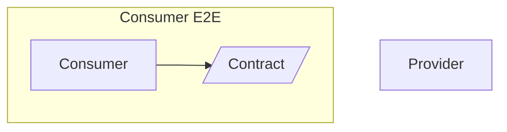
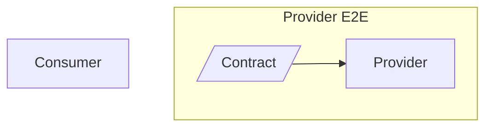

本記事はUzabase Advent Calendar 2023の8日目の記事です。

https://qiita.com/advent-calendar/2023/uzabase

# イントロダクション

私の所属する組織ProductTeamではTDDを実践しており、すべての開発においてWeb-E2E、Module-E2E、UnitTestなどを書き実装を進めています。必ずCIを通してデプロイするという環境のため、CIの高速化と安定化は非常に重要な課題です。

また、組織にはチームシャッフル[^1]という文化があり、数ヶ月～1年程度でチームの構成が変わります。そのため私はこれまでに複数のチームでCIを改善する機会がありました。
それらのプロジェクトでは、数年もののE2Eプロジェクトだったり、まだ小規模なもの、それぞれ課題や環境が異なっていました。

今回はその中で得た知見をまとめ、**CIの高速化と安定化を実現するためのTipsを紹介します。**

:::message
ProductTeamでは [Selenide](https://selenide.org/) や [Gauge](https://gauge.org/index.html) を用いたE2Eテストの実行環境を構築していることがほとんどです。E2EテストのTipsはそれらを前提にしていることが多いことをご了承ください。
<!-- textlint-disable -->
:::
<!-- textlint-enable -->

[^1]: チームの構成を定期的に変更することで、チーム間の知識共有を促進し、エンジニアの挑戦の機会を生み出す仕組みです。

## CIの高速化と安定化の重要性

CIにかかる時間が長いと、開発の効率が落ちたり、顧客へのデリバリーが遅れたりします。
開発生産性の指標であるFourKeysの1つにも "コードの変更から本番環境で稼働するまでの時間「**リードタイム**」" があり、CIにかかる時間はこの指標にも大きく影響します。
CIの不安定さがこのリードタイムに影響することは、想像に難くありません。

もちろん指標を追い求めているだけではありませんが、ユーザーに価値をデリバリーし続けていくためには、CIの高速化と安定化は重要です。

要は**CIは早ければ早いほど良いし、安定していれば安定しているほど良いということです。**

# テストの安定化

先にも述べたように、テストの不安定さがあってはCIの速度を上げることはできません。
既存のCIの改善に着手する場合、テストの安定化を優先して改善することをおすすめします。

## テストフレームワークを理解し上手く利用する

ものすごくシンプルで基本的な話ですが、テストフレームワークの理解と利用方法を把握していることは、テストの安定化には必須です。
Selenideなどのテストフレームワークは、テストの安定化に役立つ機能を提供しています。

<!-- textlint-disable -->
:::details Selenideの機能例
<!-- textlint-enable -->
- 自動的な要素の待機： 要素が見つかるまで自動的に待機する
- 非同期通信サポート： リクエストの完了を自動的に待機する
- 集成されたアサーション：要素の状態を検証するためのアサーション（Hrefなど）
:::

例として、Selenideでの要素の待機について見てみましょう。
### Good
```kotlin
fun assertElement() {
    // この場合、要素が見つからない場合、タイムアウトまでリトライする
    $(byText("Login")).shouldBe(visible);
    // この場合、要素が消えるまで待機する
    $(".loading").should(disappear);
}
```
### Bad
別のアサートライブラリなどと組み合わせると、このWait機能が働かないため、不安定なテストとなります。
```kotlin
fun assertElement() {
    // この場合、要素が見つからない場合、タイムアウトまでリトライせずすぐに失敗する
    assertThat($("ul li")).hasSize(2)
}
```

Selenideに関しては、別記事にもしていますので、そちらも参考にしてください。
[Selenideを利用するときに心がけること](https://zenn.dev/ragnar1904/articles/selenide-essentials)

CypressやPlaywrightなどのテストフレームワークも同様な機能を備えています。
[CypressのImplicit Assertions](https://docs.cypress.io/guides/core-concepts/retry-ability#Implicit-Assertions)

:::message
Web-E2E以外の文脈でも、テストフレームワークの理解はやはり重要です。
最近では[Testing Library](https://testing-library.com/)などでComponentTestを行うことが多くなってきていますが、AriaやRoleなどの概念の理解や、非同期処理の待機方法など理解すべきことは多いです。
<!-- textlint-disable -->
:::
<!-- textlint-enable -->

## シンプルなテストコードの維持

私の経験では、テストコードをシンプルに保つことは意外と難しいです。

### Step

Selenide + Gaugeという構成では、Testを記述したSpecファイルと、実際の処理を記述したStepがあるのですが、Stepはそれぞれただの関数群です。
そのため、気を抜くと単一のStepにロジックが増えてしまい、テストコードが複雑になってしまいます。

```kotlin
  @Step("<data>のリクエストがされている")
  fun assertRequest(data: String) {
    // 様々なことを知りすぎているStepの例
    // Mockサーバーのポートを取得
    val port = Config.get("mock.port")
    val url = "http://localhost:$port/requests"
    // JSONを取得
    val expected = this.javaClass.getResource("$data.json")!!.readText()
    // Wiremockのリクエスト検証
    Wiremock(port).verify(
      WireMock.getRequestedFor(WireMock.urlEqualTo(url))
        .withRequestBody(WireMock.equalToJson(expected))
    )
  }
```

テストコードであっても抽象化とそれぞれの責務を考え続け、シンプルに保つことは重要です。

```kotlin
  @Step("<data>のリクエストがされている")
  fun assertRequest(data: String) {
    val expected = ResourceLoader.read("$data.json")
    MockServer.verifyGetRequest("/requests", expected)
  }
```

ここ最近では[playtest](https://github.com/uzabase/playtest)という、一般的なGauge Stepを定義したものをライブラリ化して利用しています。例えば、HTTPリクエスト、BodyやStatusなどのアサート、Mockへのリクエスト検証などです。
Module-E2Eなどであれば、基本的なリクエスト/アサートはplaytestに含まれているため、シンプルなStepの組み合わせだけでE2Eを記述できるようになっています。


<!-- textlint-disable -->
:::details Playtestを利用した例
以下のStepはすべてPlaytestに含まれており、Configだけ用意すればStepを実装しなくてもテストを実装できるようになっています。
<!-- textlint-enable -->
```markdown
## GETリクエスト
* URL"/"にGETリクエストを送る
* レスポンスステータスコードが"200"である
* レスポンスヘッダーに"x-example-header"が存在し、その値が"example1"である
* レスポンスのJSONの"$.message"が文字列の"Hello Playtest-Gauge-Rest!"である
```
:::

### Fixture

また、Fixtureの扱いも難しいです。
例えば、違うシナリオのセットアップなのに、同じFixtureをセットアップしていることにより、Fixtureを変えたら別のテストが壊れてしまうということもあります。

```kotlin
class ExecutionHooks {
  @BeforeScenario(tags = ["companyA"])
  fun setup() {
    Fixture.setup("src/resources/companyA.csv")
  }

  @BeforeScenario(tags = ["companies"])
  fun setup() {
    Fixture.setup("src/resources/companyA.csv") // tag: companyA と同じFixture！
    Fixture.setup("src/resources/companyB.csv")
  }
}
```

**Fixtureのファイルと、テストのシナリオにはひも付きがある**のですが、それをコード上に明示的に表現することは難しいです。

社内のあるプロジェクトでは、テストのSpecファイルの配置ディレクトリと、Fixtureの配置ディレクトリを対応させ、テストの実行時にデータを自動的にSetupするようにしていました。これはすこしオレオレフレームワーク感が出るのですが、Fixtureとシナリオのひも付きがわかりやすくなり、好感触でした。

```markdown:api/companies/get.spec
<!-- default という識別子を持つ -->
## 会社名を取得できる -- default
- "/companies"にGETリクエストを送る
...
```

```kotlin
class ExecutionHooks {
    @BeforeScenario()
    fun setup(context: ExecutionContext) {
      val scenarioId = ... // context.currentScenario.nameから`default`を取得
      val specPath = ... // context.currentSpecification.fileNameからspecのパスを取得

      // 現在実行しているSpecのパスと識別子をもとにFixtureをセットアップ
      Fixture.setup("src/resources/$specPath-$scenarioId")
    }
}
```


## 順番に依存しないテスト

順番に依存するテストが安定性の面で良くないということは、直感的に理解できるはずです。
単体、直列でテストを実行するときは問題なくても、「ファイル名を変更したら壊れた」「不要なTestを消したら壊れた」ということが起きてしまいます。


これを早期に発見する1つのオプションとして、**テストをランダムに実行する**があります。
jestなども最近`--randomize`オプションをサポートするようになりました。[https://jestjs.io/docs/cli#--randomize](https://jestjs.io/docs/cli#--randomize)

また、後で触れる話に関連するのですが「CI上でテストを並列実行すると失敗する」などの問題も発生します。
テストの独立性は、常に意識しておくべきです。


## 確実なデータセットアップ

ElasticSearchなどのDatabaseを利用したテストを行う場合に多いのですが、データセットアップには注意が必要です。

ElasticSearchの場合、fixtureをindexする際にそのデータがindexに反映される時間がかかります。
そのため、以下の方法で回避する必要があります。

- Index Refresh APIを利用する
    更新のリクエストをしたあと、[Refresh API](https://www.elastic.co/guide/en/elasticsearch/reference/current/indices-refresh.html)を叩くことで即座にindex反映される。
- Indexの更新時にRefreshを行う
    クエリパラメータに`?refresh`を指定し更新リクエストを送ると、index反映を待ってレスポンスが帰ってくるようになる（[参考](https://www.elastic.co/guide/en/elasticsearch/reference/current/docs-refresh.html)）。
- Index Refresh Intervalを短くする
    `refresh_interval`を短くすることで、indexに反映されるまでの時間を短くできる。Productionでは反映すべきではないため、管理が少し煩雑になる。

このあたりの情報は、知らないとハマることが多いので、ぜひ覚えておくことをおすすめします。


## CDC（Consumer-Driven Contract）の利用によるモジュール間の依存性の解消

私たちのプロダクトはマイクロサービスで構成されており、それぞれのサービスは独立して開発されています。
各マイクロサービスの中には、いろんなモジュールから利用されるAPIもあります。あるAPIがいろんな環境で利用されるようになると、そのAPIの変更の影響範囲を把握することが難しくなります。


そこで、呼び出すモジュール（Consumer）の開発者が、自分のモジュールが利用するAPI（Provider）の仕様を「Contract」として定義します。
ConsumerはContractを前提にモック化してテストを実施し、ProviderはContractが守られていることを示すテストを実施します。これにより振る舞いを保持しながら双方が独立して開発を進めることができます。




- **ConsumerはProviderに守って欲しいAPIの仕様を定義する**
  例）`GET /users/1`のレスポンスは、`{"id": 1, "name": "John Doe"}`である。
- **ConsumerはProviderのモックを利用してテストを実施する**
  Providerのモックは、Consumerが定義したContractを守るように実装する。
- **ProviderはConsumerが定義したContractを守っていれば、常にデプロイ可能**
  Consumerが定義したContractを守るようなテストを実施する。
  上の例であれば、ProviderのTestの中に`GET /users/1`のレスポンスが`{"id": 1, "name": "John Doe"}`であることを検証するテストを書く。


これが、**Consumer Driven Contract** (CDC)と呼ばれるテスト手法です。

### CDCのメリット

CDCを利用することで、自分が知らないところで起きた修正によってテストが失敗することを防ぐことができます。
テストの安定性もそうですが、テストが落ちていることを検知できず本番にリリースしてしまい、ユーザーに影響を与えてしまうことも防げます。

また、CDCはテストの高速化を直接目的としたものではありませんが、モックを利用できることで高速化にも効果があります。
依存するモジュールのソースのチェックアウトやビルド、デプロイなどを待つ必要がなくなります。

**マイクロサービスにおける開発では、必ず利用したいテスト手法です。**

:::message
ProductTeamでは、WiremockへのStubをもとにContractを生成する[play-cdc](https://github.com/uzabase/play-cdc)を利用して、効率的にCDCを行っています。
<!-- textlint-disable -->
:::
<!-- textlint-enable -->


# CIの高速化

ここからは具体的にCIの高速化について紹介していきます。
私の経験上、CIの高速化には以下の3つが効果的です。
- テストの並列実行
- テスト中のボトルネックの解消
- テスト環境向けビルド時間の短縮（今回はあまり触れません）

## テストの並列実行

テストの並列実行は、テストの高速化において最も効果的な手法です。
私が実際に取り組んだのは、**テストの実行のみを並列化する**ものと、**テスト環境自体を並列化する**ものの2つです。

:::message alert
テストを分割して実行する場合、必ずすべてのテストが流れていることを確認しましょう。
<!-- textlint-disable -->
:::
<!-- textlint-enable -->

### 単一環境におけるテストの並列実行

テストフレームワークにはテストの並列実行をサポートしているものが多く、UnitTestなどではデフォルトで並列実行されるものもあります。

しかしE2Eの場合、テストの並列実行はテスト環境の状態を考慮しながら行う必要があります。
具体的な例を考えてみましょう。DBへの書き込みが発生するケースでは、同時に流れているテストが影響し、同じテーブルのデータを見ているテストは失敗します。


テスト環境が1つの場合、Read-onlyのテストは並列実行しても問題ないので、Writeが発生するテストと分割することで並列実行できます。


#### Read-onlyのテストとWriteが発生するテストの分割

```shell
# テスト環境の起動
docker-compose up -d
# ReadOnlyとタグが付いたテストを並列実行
mvn gauge:execute -Dtags="ReadOnly" -DinParallel=true
# ReadOnly以外のテストを直列実行
mvn gauge:execute -Dtags="!ReadOnly"
```

:::message
このとき、Read-onlyのTestのデータセットアップはTestスイートが流れる前の一度だけになります。シナリオごとに毎回セットアップはできません。
一方でWriteが発生するテストのデータセットアップは、シナリオごとに行う必要があります。
<!-- textlint-disable -->
:::
<!-- textlint-enable -->

#### この手法のメリット
- **どのCI環境でも比較的簡単に実装できる**
  テスト環境さえ立ててしまえれば良いので、インフラを選びません。


#### この手法のデメリット
- **あとから導入が難しい**
  この手法の並列実行をあとから導入することはかなり難しいです。Read-onlyのシナリオを特定し、それらが依存しているデータを特定し他のシナリオと依存し合わないようセットアップする必要があります。
  またMockサーバーのリクエスト検証などが絡むと更に難しくなっていきます。
- **テストによっては、高速化の効果は薄い**
  並列実行できるテストが限られてしまうため、並列実行の効果が限定的です。
- **テストコードの複雑性が上がる**
  Read-onlyなものとそうでないものでデータセットアップのサイクルが変わるので、少し煩雑です。

#### 社内での実践例

ProductTeam内では、この手法を利用しているプロジェクトは多く、新規プロジェクトではこの並列実行を見越してデータセットアップの戦略を立てることもあります。
また、最初は直列実行ではあったものの、後からこの手法を導入したプロジェクトもあります。

ただ実情として、並列化したいWeb-E2Eでは安定しないことも多く、結局直列に戻したという話もあります。
チームシャッフルでメンバーの変わることも多いProductTeamでは、テストコードの複雑性のデメリットが大きいかもしれません。

厳密に言うと、テストシナリオ毎にそれぞれ違うレコードを参照すればWriteのテストも並列実行できるのですが、やっていてあまりできるイメージが湧きませんでした。うまくやっている方がいれば教えていただきたいです。

### 複数環境でのテストの並列実行

Test環境自体を複数にし、テストを分割することで並列実行を行うこともできます。
k8sのNamespaceを複数利用して環境を分割するなどが考えられます。


#### この手法のメリット
- **テストの安定性が高い**
  テスト環境はそれぞれ独立しているため、分割したテスト間の影響はありません。
- **複雑で大きなE2Eプロジェクトでも、あとから導入できる**
  直列実行しているテストであれば、そのまま分割するだけなので、大規模なE2Eプロジェクトでも救いの一手になる可能性があります。
  ただ、順番に依存しているテストは撲滅する必要があります。
- **並列実行の効果が高い**
  単純に実行するテストを2つに分割するだけでも、単純計算では半分の時間でテストを終えられます（テストによって実行時間が異なるので、単純に半分とはいきませんが）。

#### この手法のデメリット
- **パイプラインおよびテストの設定が複雑**
  パイプライン上でテストの分割をおこなったり、環境それぞれに対してテスト設定を行う必要があります。

- **CI環境に左右される**
  実行する環境によっては、複数のテスト環境を同時に起動できない場合があります。例えば、同一のホスト上で同じ`docker-compose.yaml`を利用してテスト環境を起動する場合などです。
  また、環境を複数分割・複数のテストを同時に実行しようとすると、ネットワーク周りやリソース周りの影響も無視できなくなります。
  実体験として環境を増やしていくにつれ、テスト環境が上手く立ち上がらない、テストがタイムアウトで失敗するなどが頻発し、SREのメンバーと頭を抱えていました。

- **インフラコストがかかる**
  クラウド上の場合、環境を増やすと基本的にはインフラコストが増加します。後述の例では、SPOTインスタンスを利用してコストを抑えています。

#### 社内での実践例

あるプロジェクトのWeb-E2Eは2年以上の歴史があり、パイプライン全体の実行時間は**2時間程度**かかっていました。
このE2Eは、そのStepに紐付けられたTagをもとにデータをセットアップする形式をとっており、規模的にもデータセットアップからリファクタリングすることはかなり難しい状況でした。

##### イメージ

再利用性は高いが、テストが増えていくたびにセットアップデータへの依存が増えていく。

```markdown:company.spec
## 会社ページに遷移できる
tags: user, company
- "user"でログインする
- "company"の会社ページに遷移する
...
```

```markdown:user.spec
## ユーザーページに遷移できる
tags: user
- "user"でログインする
- "user"のユーザーページに遷移する
...
```

```kotlin
class ExecutionHooks {
    @BeforeScenario(tags = ["user"])
    fun setupUser() {
        // ユーザーのセットアップ
        // これは、company.specとuser.specで必要・・・
    }

    @BeforeScenario(tags = ["company"])
    fun setupCompany() {
        // 会社のセットアップ
        // これは、company.specとxxxx.spec, yyyy.spec....
    }
}
```

##### Buildkite

CI環境には、k8s上で[Buildkite](https://buildkite.com/)を利用していました。
Buildkiteはセルフホスト型のCIサービスです。ユーザーは実行環境であるBuildkite Agentを様々なインフラに構築でき、Buildkiteがパイプラインの各種マネジメントを行ってくれます。
k8s上でBuildkite Agentを動かすことも可能で、Agent（＝テスト実行環境）のスケールアウトを簡単に行うことができます。


*Buildkite Hybrid Architecture（[公式](https://buildkite.com/docs/pipelines/architecture)より）*

また、Buildkiteはパイプラインの各ステップを容易に並列実行できること、動的にステップを生成しやすいなどの特徴もあります。
さらにProductTeamでは、dindコンテナをAgentのサイドカーとして動かし、k8sのBuildkite Agent上でDockerを動かすことができるようになっています。**Agentを増やせばテスト環境も増やせる**という状況でした。

そこでAgentを20台にスケールアウトし、それぞれの環境でテスト環境を立ち上げテストを実行するようにしました。
Testの分割に関してはシェルスクリプトでGaugeのファイルを20個のグループに分割し、それぞれのAgentで実行するようにしました。

```yaml
# buildkiteパイプラインの設定イメージ
steps:
  - label: ":pipeline: Generate pipeline"
    command:
      - |

        specs=... # すべてのSpecを取得
        spec_group=... # group化する
        for specs_list in group; do
          # buildkite-agent pipeline uploadでパイプラインを生成
          # (これらは並列実行されます)
          buildkite-agent pipeline upload <<YAML
          steps:
            - label: "Build and run tests"
              command:
                - docker-compose up -d
                - mvn gauge:execute -Dtags="$$spec_list"
                ...
```

結果として20並列でテストを実行できるようになり、パイプライン全体の実行時間は**30分**程度に短縮されました。
上述したインフラ面の問題にも直面しましたが、k8sの各ノードにAgentを1つずつ配置することで、テスト環境の増加に伴う問題は解決しました。


ただ社内でも例が少なく長期的に運用していないこともあり、これからの安定性についてはまだ検証が必要です。

## テスト中のボトルネックの解消

やることはシンプルで、テストの実行中時間がかかっている部分を特定し、その時間を削減することです。
特にシナリオごとに行う処理には伸びしろがある場合があります。**テストシナリオの数に比例して時間がかかる**ためです。

### ログイン処理のSkip

ログイン処理は、非同期処理が絡み頻度も高いため、テストの実行時間を大きく伸ばす原因になります。
特定のシナリオ郡はログアウトせず、ログインまでの共通処理をSkipしてしまうようにし、テストの実行時間を削減します。初回のみログイン処理を行うようにします。


### データセットアップのSkip

テストの実行中にデータセットアップを行う場合、無視できない時間がかかる場合もあります。
前述のElasticSearchの例のようにどうしても時間がかかってしまう場合は、より効果的です。

以下のような流れになります。
- テストスイートの開始時にデータセットアップ
  テストスイートの最初に、必要な全てのデータをセットアップします。
- データの共有（Read-onlyのものに限る）
  同一のテストスイート内の複数のテストシナリオで、セットアップしたデータを共有します。

この方法を取る場合、テストシナリオの独立性を保つための工夫が必要になります。
あるシナリオで`user_id=1`のデータを参照している場合、他のシナリオで`user_id=1`のデータへ依存しないようにするなどです。
Fixtureとシナリオにはひも付きがあると上でも述べましたが、これを意識しないと後々テストデータの変更が難しくなったり、リファクタリングが難しくなります。


### WebDriverセッションのオーバーヘッド削減

WebDriverベースのテストフレームワークを利用している場合、テストの実行中にWebDriverのセッションを作成する処理が発生します。テスト環境によってはそのオーバーヘッドが大きくなるため、注意が必要です。

#### 社内での実践例

あるプロジェクトのWeb-E2Eでは、数ページ分のテストケースの割にCI環境でのテストの実行時間が長く、頭を悩ませていました。10ページ分もないE2Eに1時間。流石におかしいと思った私は色々とコードを眺めていました。

ふと目についた以下の1行の変更で、テストの実行時間を**1時間**から**15分**に削減できました。

```kotlin
    @AfterScenario
    fun tearDownScenario() {
-        WebDriverRunner.closeWebDriver()
+        localStorage().clear()
    }
```

上記の例では、ログインセッションを破棄するため、毎シナリオ終わりにWebDriverをcloseしていました。つまり、シナリオ1つにつき1回WebDriverのセッションを作成していたのです。これは、ローカルではさほど気になりませんでした（ない方がいいですが）。

しかしCI環境ではk8s上で[SeleniumGrid](https://www.selenium.dev/ja/documentation/grid/)を利用しており、**毎シナリオごとにPodが作成されていたのです。**
常に注意深く問題を探すことが重要だと感じた出来事でした。

## テスト環境向けビルド時間の短縮

もちろん、テスト環境向けビルド時間の短縮も重要です。
ビルド時間短縮の詳細に関して今回はあまり触れませんが、基本的にはCacheを利かせることが重要になってきます。

- **依存関係のCache**
  - Maven, npmなどの依存関係をCacheする
- **テストコードのCache**
  - テストコードのビルド結果をCacheする
- **ビルドプロセスの改善**
  - 並列ビルド
  - 差分がない場合はビルドをSkipする
- **Dockerイメージのビルド**
  - Multi-stage buildを利用する
  - Baseイメージとなるイメージを分離する
    - apt-getなどのインストールが多い場合はBaseイメージを分離し、1日1回ビルドしておくなど


# まとめ

CIの高速化と安定化に関して、いくつかのTipsを紹介しました。

特にE2Eの高速化戦略に関しては、以下のように整理できます。

- **シナリオに完全に独立性をもたせる**
  - 毎シナリオごとに、データセットアップを行う
    - テストコードのシンプリシティが高い
  - 順番に依存させない
  - 並列実行のためには、独立したテスト環境を複数用意する
- **テスト中、データストアが状態を持つことを許容する**
  - データセットアップをSkipできる
  - 並列実行のためには、テストをグループ化して分割する
    - テストフレームワークの並列実行機能を利用できる

私としては後者は考慮すべきことが多くなるため、認知コストが低い前者推しですが、インフラ面やCI環境によっては後者の方が実現しやすい場合もあります。

また、以下はテスト戦略に関わらないものです。
- **テストフレームワークを理解する**
- **テストコードをシンプルに保つ**
- **オーバーヘッドの大きい処理を見つけ、削減する**

これらの知見をCIの改善に役立てていただければ幸いです。
